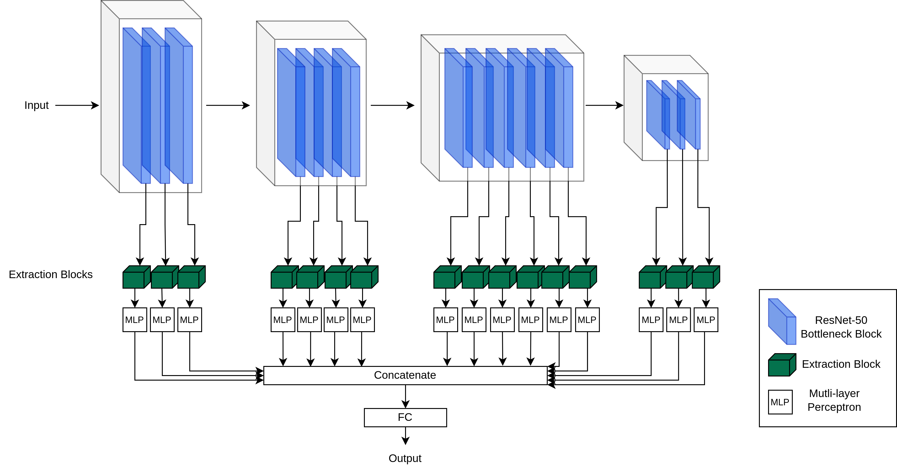

# Welcome to M<sup>2</sup>-CL

This is the official code for the "Multi-Scale and Multi-Layer 
Contrastive Learning for Domain Generalization" [paper](https://ieeexplore.ieee.org/document/10472869), 
which has been published in the [IEEE Transactions on 
Artificial Intelligence](https://ieeexplore.ieee.org/xpl/RecentIssue.jsp?punumber=9078688) journal.
The preprint is also available [here](https://arxiv.org/abs/2308.14418).

## Method
 In this work, we argue that the problems caused by
domain shift between data drawn from unknown domains can be mitigated
by utilizing multiple levels of information passed throughout a
Convolutional Neural Network, in order to derive disentangled
representations.




## Quick start

Download the datasets:

```sh
python3 -m domainbed.scripts.download \
       --data_dir=./domainbed/data
```

Available alogrithms in [algorithms.py](./domainbed/algorithms.py). 

Train a model:

```sh
python3 -m domainbed.scripts.train\
       --data_dir=./domainbed/data/PACS/\
       --algorithm ERM\
       --dataset PACS\
       --test_env 2
```

Train with our models:

```sh 
# Train with M2 model 
python3 -m domainbed.scripts.train\
       --data_dir=./domainbed/data/PACS/\
       --algorithm M2\
       --dataset PACS\
       --test_env 2

# Train with M2CL model 
python3 -m domainbed.scripts.train\
       --data_dir=./domainbed/data/PACS/\
       --algorithm M2CL\
       --dataset PACS\
       --test_env 2
```


## Cite Us
If you use the above code for your research please cite our paper, which as of the 8th of March 2024 has been accepted in [IEEE TAI](https://ieeexplore.ieee.org/xpl/RecentIssue.jsp?punumber=9078688):
```citation
@ARTICLE{10472869,
  author={Ballas, Aristotelis and Diou, Christos},
  journal={IEEE Transactions on Artificial Intelligence}, 
  title={Multi-Scale and Multi-Layer Contrastive Learning for Domain Generalization}, 
  year={2024},
  volume={},
  number={},
  pages={1-14},
  keywords={Feature extraction;Training;Task analysis;Self-supervised learning;Adaptation models;Representation learning;Image classification;Domain generalization;Representation learning;Contrastive learning;Image classification},
  doi={10.1109/TAI.2024.3377173}
}
```
